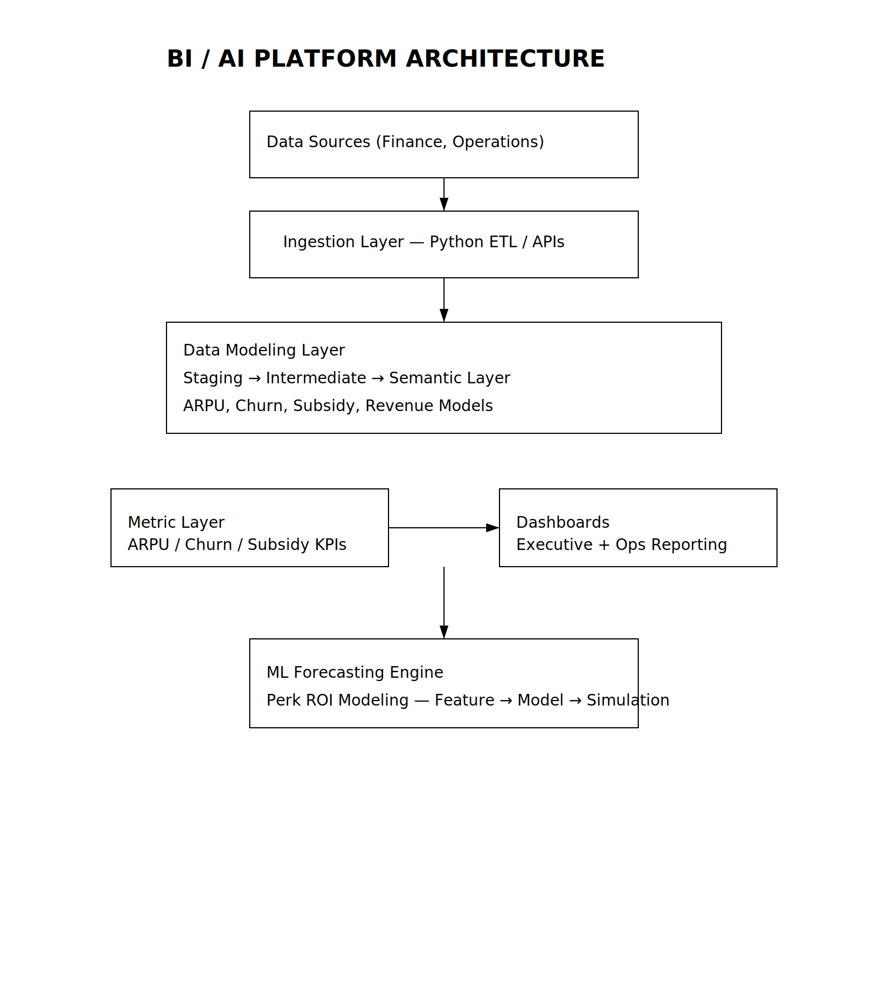

# Enterprise BI & AI Analytics Platform  
**End-to-End BI Architecture | Python ETL | Metric Layer | ML Forecasting**

---

## Overview
This project documents the enterprise BI/AI analytics platform I built and led at Verizon.  
It demonstrates how I designed and automated data workflows, standardized metric modeling, and integrated predictive analytics into executive reporting systems.

---

## Architecture

---

## Key Responsibilities
- Designed enterprise BI/AI roadmap and data platform architecture  
- Automated ETL pipelines using Python + SQL  
- Implemented KPI metric layer (subsidy margin, ARPU, churn indicators)  
- Built ML forecasting models for perk ROI and scenario planning  
- Delivered real-time executive dashboards for financial & operational insights  

---

## Components
### 1. Data Ingestion  
Python-based ingestion pipelines pulling financial & operational datasets.

### 2. Data Modeling  
Standardized staging → intermediate → semantic layers for consistent metrics.

### 3. KPI Metric Layer  
Definitions for ARPU, subsidy margin, churn indicators, acquisition metrics.

### 4. ML Forecasting Engine  
Perk usage forecasting, cost simulation, ROI modeling.

### 5. Dashboard Layer  
Qlik dashboards built on clean semantic models.

---

## Tech Stack
Python · SQL · ETL · Data Modeling · ML Forecasting · Qlik  

